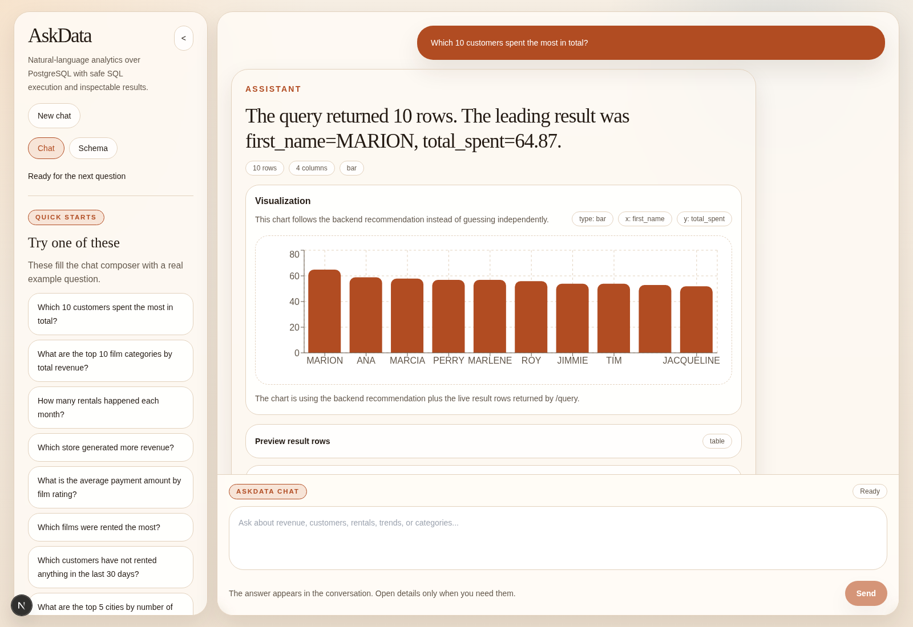
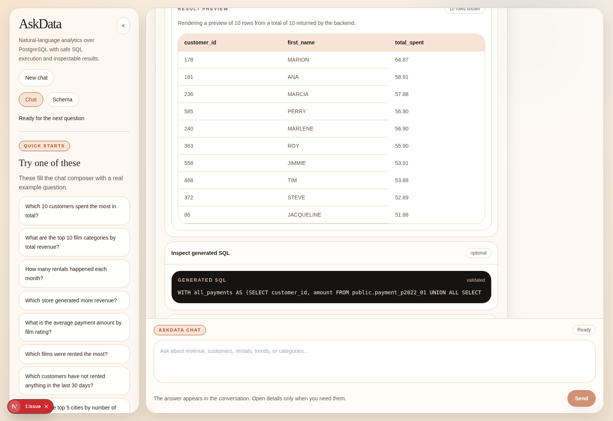
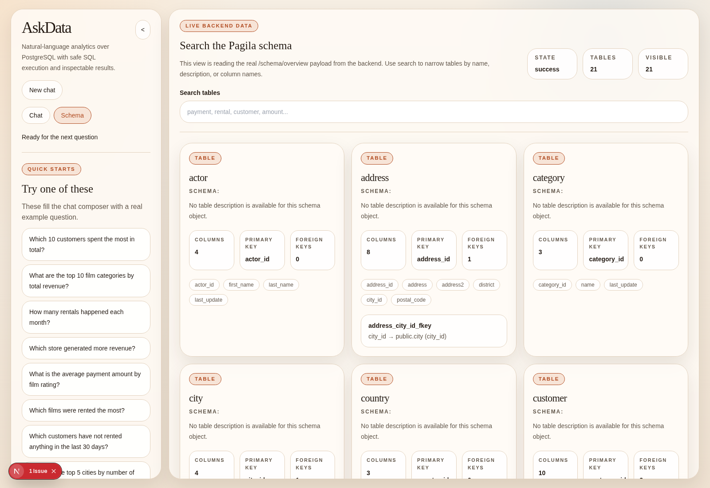
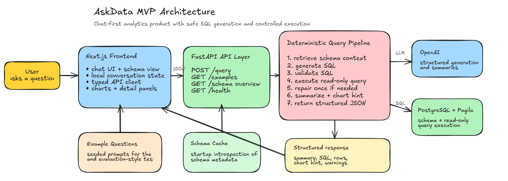

# AskData

AskData is a web app for asking questions about a PostgreSQL database in plain language.

You type a business question, the backend turns it into SQL, checks that the SQL is safe, runs it against PostgreSQL, and returns:

- a short answer
- the SQL it used
- result rows
- a simple chart when it makes sense
- the tables involved

This project is still at the MVP stage, but it already works end to end and is designed to be easy to run locally.

## What the product looks like

### Main chat view



### Inspecting the answer details



### Schema view



## How it works

The product has three main parts:

- a `Next.js` frontend
- a `FastAPI` backend
- a `PostgreSQL` database loaded with the Pagila sample dataset

At a high level, the request flow is:

1. the user asks a question in the chat UI
2. the backend finds the most relevant schema context
3. the backend asks the model for SQL
4. the SQL is validated with read-only rules
5. the SQL is executed against PostgreSQL
6. the backend formats the result for the UI

## Architecture



The editable diagram source is included here:

- [askdata-system-architecture.excalidraw](assets/architecture/askdata-system-architecture.excalidraw)

## Current scope

The current MVP includes:

- PostgreSQL only
- Pagila as the working dataset
- natural-language question input
- schema overview
- schema-aware retrieval
- SQL generation with an LLM
- parser-based SQL validation
- read-only execution with timeout and row limits
- a conversation-style UI with session-local follow-up context

The current MVP does **not** include:

- user-provided databases
- authentication
- persistent chat history
- multi-database support
- dashboard building

## Stack

### Frontend

- `Next.js`
- `TypeScript`
- `Tailwind CSS`
- `Recharts`

### Backend

- `FastAPI`
- `Pydantic`
- `psycopg`
- `sqlglot`
- `OpenAI`

### Data and local infrastructure

- `PostgreSQL`
- `Docker Compose`
- `Pagila`

## Repo structure

```text
AskData/
├─ backend/
│  ├─ app/
│  │  ├─ api/
│  │  ├─ core/
│  │  ├─ db/
│  │  ├─ llm/
│  │  ├─ schemas/
│  │  ├─ services/
│  │  └─ utils/
│  └─ tests/
├─ frontend/
│  ├─ app/
│  ├─ components/
│  ├─ lib/
│  └─ styles/
├─ demo_data/
│  ├─ example_questions/
│  └─ seed/
├─ assets/
│  ├─ architecture/
│  └─ readme/
├─ docker-compose.yml
└─ Makefile
```

## Run locally

### Prerequisites

You need:

- `Python 3.11+`
- `Node.js 20+`
- `npm`
- `Docker` and `Docker Compose`
- an `OPENAI_API_KEY`

### 1. Start PostgreSQL

```bash
make docker-up
```

This starts PostgreSQL and loads Pagila from:

- `demo_data/seed/pagila.sql`

The local database is exposed on:

- `localhost:55432`

### 2. Create local env files

Backend:

```bash
cp backend/.env.example backend/.env
```

Then set your real OpenAI key in `backend/.env`.

Frontend:

```bash
cp frontend/.env.example frontend/.env.local
```

### 3. Install dependencies

Backend:

```bash
make backend-install
```

Frontend:

```bash
make frontend-install
```

### 4. Start the app

Backend:

```bash
make backend-dev
```

Frontend:

```bash
make frontend-dev
```

Open:

- frontend: `http://127.0.0.1:3000`
- backend: `http://127.0.0.1:8000`

## Verify the project

Run the main checks:

```bash
make verify
```

That runs:

- backend tests
- frontend lint
- frontend production build

You can also check the backend directly:

```bash
curl http://127.0.0.1:8000/health
curl http://127.0.0.1:8000/examples
curl http://127.0.0.1:8000/schema/overview
```

## Example questions

Try these in the chat UI:

- `Which 10 customers spent the most in total?`
- `What are the top 10 film categories by total revenue?`
- `How much revenue did each staff member process?`
- `How many rentals happened each month?`
- `Now show only the top 5`

## Safety rules

The backend currently enforces:

- `SELECT`-only queries
- no `INSERT`, `UPDATE`, `DELETE`, `DROP`, or `ALTER`
- no multiple statements
- parser-based SQL validation before execution
- read-only execution
- statement timeout
- row limit policy
- at most one repair attempt

## Current limitations

- answer quality is good for many common questions, but not perfect
- follow-up support is lightweight
- conversation history only lives in the current browser session
- chart selection is heuristic
- Pagila quirks can appear in user-facing answers

## Project status

The project is currently in Phase 4: packaging and deployment preparation.

Completed so far:

- backend MVP
- frontend MVP
- conversation-first UI refinement
- quality improvements for retrieval and formatting
- local setup cleanup
- README, screenshots, and architecture assets

## Deployment note

The app is not publicly deployed yet.

The current recommended future setup is:

- frontend on Vercel
- backend on Render or Railway
- PostgreSQL on Neon or another managed Postgres provider

Deployment is intentionally deferred until hosting, costs, and public-demo protections are reviewed more carefully.
