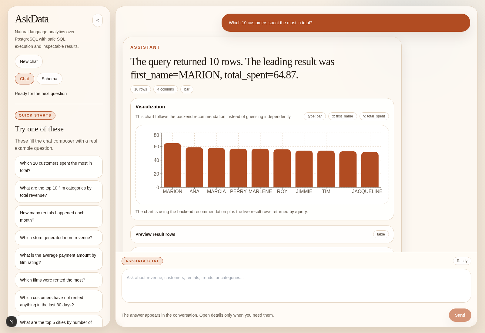
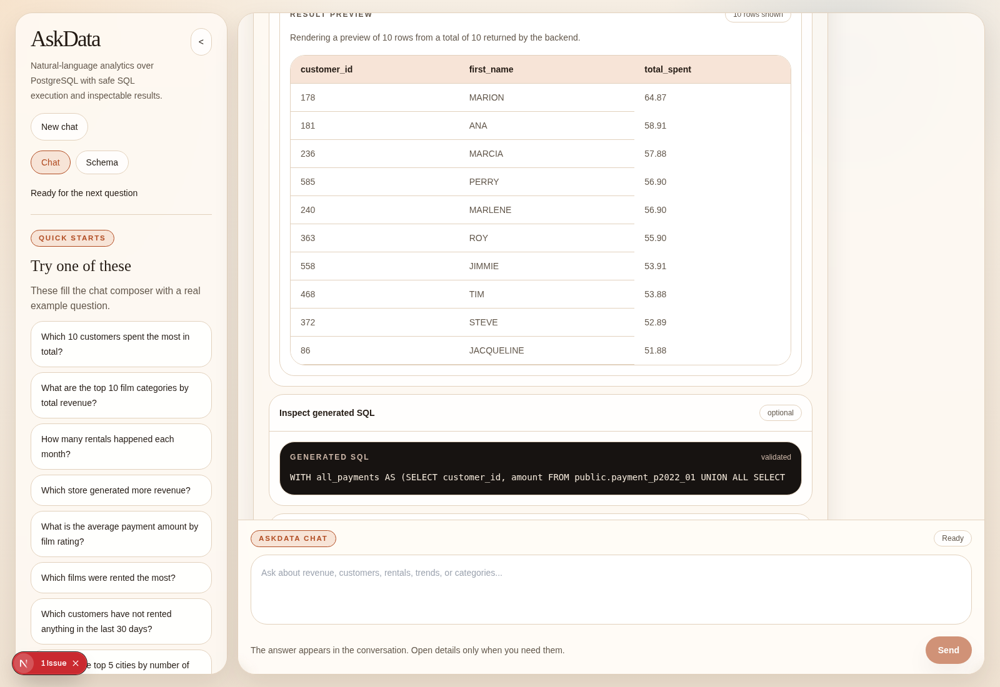
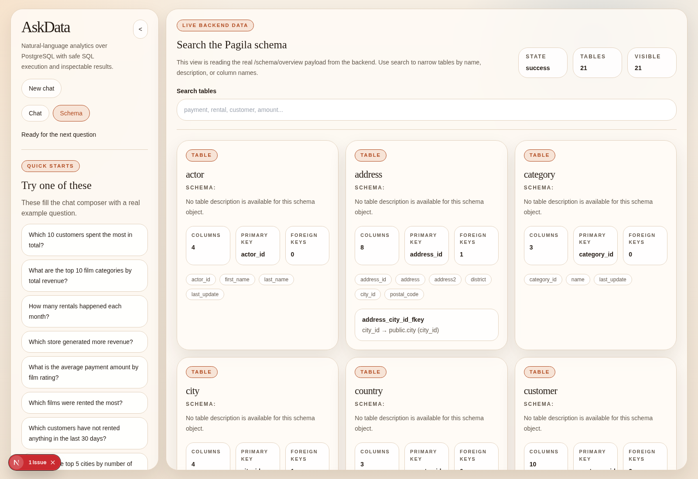
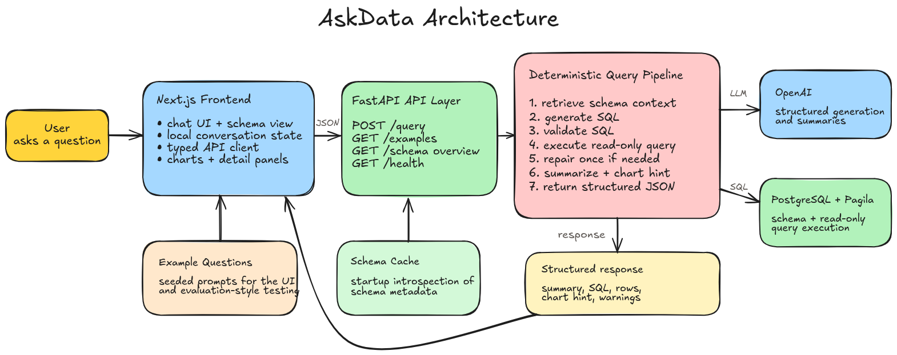

# AskData

AskData is a web application for asking questions about a PostgreSQL database in plain language.

The app turns a question into a read-only SQL query, runs it against PostgreSQL, and returns:

- a direct answer
- a result table when it helps
- a chart when the result is clearly suited to one
- the SQL and table lineage behind the answer when you want to inspect it

AskData is built as a product, not just a text-to-SQL script. It includes a chat interface, schema view, local session history for the demo datasets, and a runtime PostgreSQL connection flow for testing the system on another database.

## Screens

### Main chat view



### Answer details



### Schema view



## Capabilities

AskData currently supports:

- PostgreSQL only
- two included demo datasets:
  - `pagila`
  - `retail_ops`
- runtime PostgreSQL connection from the UI
- schema overview for the active target
- schema-aware retrieval before SQL generation
- planner-guided SQL generation
- SQL validation for read-only safety
- bounded repair and retry behavior
- answer formatting with:
  - answer text
  - table
  - bar chart
  - line chart
- local persisted session history for demo datasets

Current limits:

- no authentication
- no saved database connections
- no secret vaulting
- no non-PostgreSQL databases
- runtime PostgreSQL mode is ephemeral and does not use persisted session history

## Architecture

AskData has three main runtime pieces:

- `Next.js` frontend
- `FastAPI` backend
- `PostgreSQL`

The backend flow is:

1. receive a question
2. load the active schema context
3. build a lightweight plan
4. retrieve relevant tables and columns
5. generate SQL
6. validate the SQL against read-only rules
7. execute the query
8. format the answer for the UI

The backend uses a custom bounded pipeline rather than a generic agent framework.



Editable source:

- [askdata-system-architecture.excalidraw](assets/architecture/askdata-system-architecture.excalidraw)

## Stack

Frontend:

- `Next.js`
- `TypeScript`
- `Tailwind CSS`
- `Recharts`

Backend:

- `FastAPI`
- `Pydantic`
- `psycopg`
- `sqlglot`
- `OpenAI`

Local infrastructure:

- `PostgreSQL`
- `Docker Compose`

## Repo Layout

```text
AskData/
├─ backend/
├─ frontend/
├─ demo_data/
├─ assets/
├─ docker-compose.yml
└─ Makefile
```

## Run Locally

### Prerequisites

- `Python 3.11+`
- `Node.js 20+`
- `npm`
- `Docker` and `Docker Compose`
- `OPENAI_API_KEY`

### 1. Start PostgreSQL

```bash
make docker-up
```

PostgreSQL is exposed on `localhost:55432`.

### 2. Choose the active demo dataset

AskData starts on `pagila` by default.

To switch demo datasets:

```bash
make load-dataset DATASET=retail_ops
```

Available values:

- `pagila`
- `retail_ops`

This reloads the `public` schema and leaves the internal `askdata_app` schema intact.

Important:

- built-in demo switching is shared in local mode because it reloads one local demo database
- runtime PostgreSQL targets are per browser token and live only in backend memory in this version

### 3. Create local env files

Backend:

```bash
cp backend/.env.example backend/.env
```

Then set your OpenAI key in `backend/.env`.

Frontend:

```bash
cp frontend/.env.example frontend/.env.local
```

### 4. Install dependencies

```bash
make backend-install
make frontend-install
```

### 5. Start the app

```bash
make backend-dev
make frontend-dev
```

Open:

- frontend: `http://127.0.0.1:3000`
- backend: `http://127.0.0.1:8000`

## Using the App

### Demo datasets

When a demo dataset is active, AskData supports:

- suggested questions
- persisted local session history
- session rename
- rerun
- CSV export

### Runtime PostgreSQL connection

You can connect a PostgreSQL database from the sidebar with:

- host
- port
- database
- user
- password
- ssl mode
- optional schema allowlist

In runtime PostgreSQL mode:

- AskData uses the connected database for schema view and query execution
- suggested demo questions are hidden
- session history is disabled
- the connection is temporary and disappears after backend restart

## Verify the Project

Run the main checks:

```bash
make verify
```

That runs:

- backend tests
- frontend lint
- frontend build

Useful direct checks:

```bash
curl http://127.0.0.1:8000/health
curl http://127.0.0.1:8000/data-sources
curl http://127.0.0.1:8000/schema/overview
```

If you switch demo datasets while the backend is already running, you can refresh the active schema cache with:

```bash
make reload-schema-cache
```
